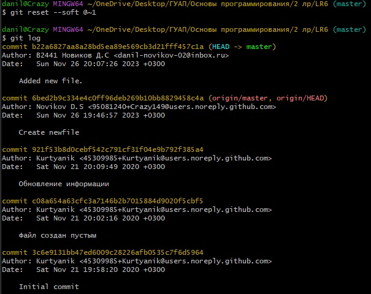
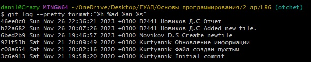

# LR6
Лабораторная работа №6

Цель лабораторной работы: изучение базовых возможностей системы управления версиями, опыт работы с Git Api, опыт работы с локальным и удаленным репозиторием.

**Выполнение работы**

* Клонировать свой личный удаленный репозиторий на компьютер.

``` bash
 git clone https://github.com/Crazy149/LR6.git
```

* Добавить файл через интерфейс GitHub. Подянуть изменения в локальный репозиторий

```bash
git pull
```

* Получить историю операций для каждой из веток

```bash
git log --graph
```

* Посмотреть последние изменения.

```bash
git log
```
* Выполнить слияние в ветку master, разрешив конфликт.


```bash
git branch newbranch
git checkout newbranch
git add . 
git commit 
git checkout master
git merge 
```

* Удалить побочную ветку после успешного слияния.

```bash
git branch -d newbranch
```

* Сделать изменения и зафиксировать их, оставляя коментарии.

```bash
git add . 
git commit
```
* Сделать откат коммита


* Получена история операций в форматированном виде


* Отправить локальные изменения в сетевое хранилище GitHub
```bash
git push -u origin 
```
